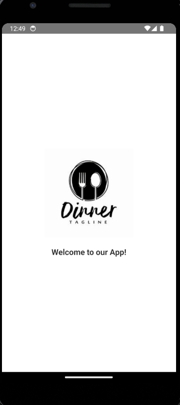

React Native CLI Project

This repository demonstrates two key features for a React Native CLI project:

Remote Configuration in the Splash Screen

Nested Menu Item Implementation

Features

1. Remote Configuration in the Splash Screen

The splash screen displays dynamic data fetched from a remote configuration server. This ensures that users see updated content or settings without needing to update the app.

Steps to Implement:

Install Dependencies

npm install @react-native-firebase/app @react-native-firebase/remote-config

Set Up Firebase

Add your google-services.json (for Android) and GoogleService-Info.plist (for iOS) to the appropriate directories.

Initialize Remote Config
In your splash screen component (e.g., SplashScreen.js):
